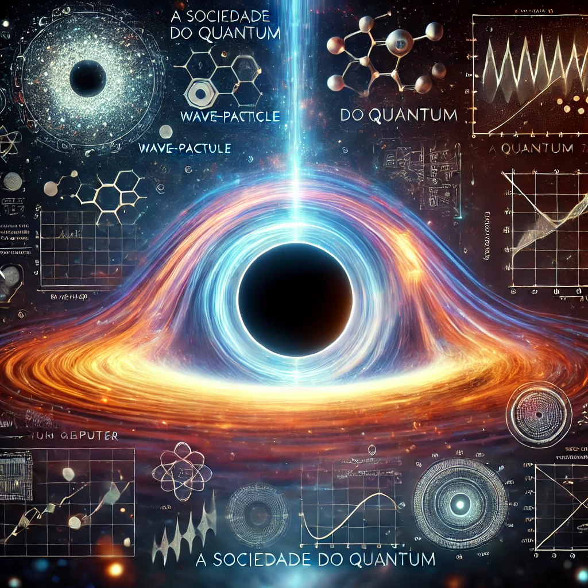

    Preview do podcast

    <audio src="output/podcast_editado.mp3" controls title="Podcast editado"></audio>

# Projeto Podcast Gerado por I.A.s

 > ℹ️ **NOTE:** Este repositório é o resultado do projeto de PodCast do BootCamp Caixa - IA Generativa com Microsoft Copilot [DIO](https://dio.me)

Projeto com o objetivo de gerar um podcast utilizando ferramentas de IA através de prompts mais trabalhado.

Utilize uma esteira de prompts para gerar cada etapa do processo criativo.

## 💻 Tecnologias utilizadas no projeto

- [ChatGPT](https://chat.openai.com/)
- [ElevenLabs](https://beta.elevenlabs.io/)
- [Capcut](https://www.capcut.com/pt-br/)

## ✨ Como foi feito ?

- Roteiro e capa gerado via chatgpt
- Audio gerado pela elevenLabs
- Gemini Para gerar capas
- Capcut para tratar aúdio e adicionar sons de fundo

---

## Edição do podcast

- Downpour by Keys of Moon | https://soundcloud.com/keysofmoon - Music promoted by https://www.chosic.com/free-music/all/ - Creative Commons CC BY 4.0 - https://creativecommons.org/licenses/by/4.0/

---
⌨️ com 💜 por [Ronaldo Silva](https://github.com/ronaldofas)